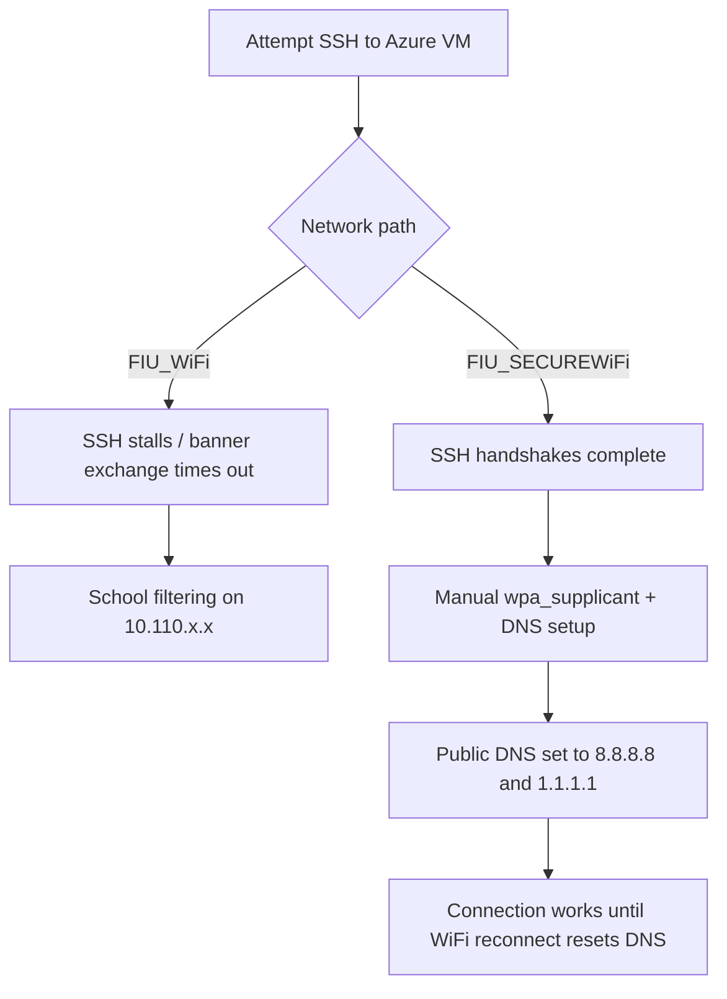

*Consolidated technical record for future GitHub documentation*

## Navigation Key

| Section | Jump |
|---|---|
| 1. Problem Summary | [Go to section](#1-problem-summary) |
| 2. Client and Network Environment | [Go to section](#2-client-and-network-environment) |
| 3. Initial Error and Early Findings | [Go to section](#3-initial-error-and-early-findings) |
| 4. Earlier Server and Authentication Checks | [Go to section](#4-earlier-server-and-authentication-checks) |
| 5. Complete Command Log from the Final Investigation | [Go to section](#5-complete-command-log-from-the-final-investigation) |
| 6. Additional TCP-Level Investigation | [Go to section](#6-additional-tcp-level-investigation) |
| 7. Final Diagnosis | [Go to section](#7-final-diagnosis) |
| 8. Lessons / Future Troubleshooting Notes | [Go to section](#8-lessons--future-troubleshooting-notes) |
| 9. GitHub Publishing Notes | [Go to section](#9-github-publishing-notes) |
| 10. Status | [Go to section](#10-status) |
| 11. Consolidated Summary | [Go to section](#11-consolidated-summary) |

Use the links above to jump straight to the section you need.

# 1. Problem Summary

The Fedora Linux installation could not establish a working SSH session
to an Azure VM at 20.127.14.122:22. The same VM was reachable
successfully from another environment on the same physical laptop,
specifically Ubuntu LTS under WSL on the Windows installation. The
investigation began as a suspected client-side SSH problem, but the
final evidence showed that the network path was the deciding factor.

- The SSH server was functional because another machine/environment
  could connect.

- The affected Fedora connection reached TCP port 22, but SSH
  negotiation stalled.

- The same Azure VM worked from WSL/Windows.

- The decisive difference was network access: FIU_WiFi blocked SSH,
  while FIU_SECUREWiFi allowed it after manual wireless configuration.

The laptop is dual-booted with Windows and Fedora Linux. The Windows
installation also runs Ubuntu LTS through WSL.

Fedora and Windows/WSL use different IP addresses, which is an important
troubleshooting variable because they may present different source IPs
or network paths to the Azure VM.

# 2. Client and Network Environment

| Item                      | Details                                                                                               |
|---------------------------|-------------------------------------------------------------------------------------------------------|
| Laptop layout             | Dual-boot machine with Windows and Fedora Linux.                                                      |
| Windows environment       | Windows partition includes Ubuntu LTS through WSL.                                                    |
| Network observation       | Windows/WSL and Fedora use different IP addresses. This became an important troubleshooting variable. |
| Fedora interface          | wlo1                                                                                                  |
| Fedora source IP observed | 10.110.218.116                                                                                        |
| Fedora gateway observed   | 10.110.192.1                                                                                          |
| Fedora MTU                | 1500                                                                                                  |
| Azure VM                  | 20.127.14.122, TCP 22                                                                                 |
| SSH client                | OpenSSH 10.0                                                                                          |
| Working comparison        | Ubuntu LTS in WSL on Windows could connect to the same Azure VM.                                      |

# 3. Initial Error and Early Findings

kex_exchange_identification: read: timeout  
banner exchange: connection to 20.127.14.122 port 22: timed out

Early verbose SSH output reached the client version string:

debug1: Local version string SSH-2.0-OpenSSH_10.0

This initially looked like an OpenSSH/client problem because the failure
occurred before normal authentication. Later testing showed that the
same connection behavior could be reproduced outside OpenSSH and that
the result changed with the WiFi network.

# 4. Earlier Server and Authentication Checks

These checks were performed during the earlier investigation. They are
kept here once, without repeating the same tests in the later command
log.

## Restarted SSH service

sudo systemctl restart sshd

Result: No change.

## Checked SSH service status

sudo systemctl status sshd

Result: Service was running normally.

## Regenerated SSH host keys

Server host keys regenerated

Result: No change.

## Checked server logs

/var/log/auth.log  
/var/log/secure  
journalctl -u sshd

Result: No meaningful errors showed an explicit rejection of the
affected PC.

## Verified authorized keys

Checked public key presence and SSH/.ssh permissions

Result: Public key was present; permissions were reported as correct,
including 600 for key files and 700 for .ssh.

## Verified client key

Private key matched the server public key; same key worked elsewhere

Result: Key was valid.

## Tried alternate key

Generated and tested another key pair

Result: Still failed from the affected PC.

## Checked local SSH config

~/.ssh/config

Result: No obvious misconfiguration.

## Checked key permissions

chmod 600 ~/.ssh/id_rsa  
chmod 700 ~/.ssh

Result: Permissions were correct.

## Removed known_hosts entry

Removed server entry from ~/.ssh/known_hosts

Result: No change.

## Tried explicit key

ssh -i ~/.ssh/id_rsa user@host

Result: Still failed.

## Tried another network

Home network and mobile hotspot

Result: Still failed during the earlier investigation.

# 5. Complete Command Log from the Final Investigation

The following commands are recorded in the order used during the final
Fedora, Docker, and FIU WiFi investigation. Redundant earlier tests are
not repeated here. The Docker comparison started with Alpine and then
moved to Ubuntu because Ubuntu provided the expected sudo tooling and
repository setup needed for continued testing.

## 5.1 Disable Fedora systemd SSH proxy

sudo mv /etc/ssh/ssh_config.d/20-systemd-ssh-proxy.conf \\  
/etc/ssh/ssh_config.d/20-systemd-ssh-proxy.conf.disabled

Result: Disabled the Fedora systemd SSH proxy configuration to rule it
out as a client-side cause.

## 5.2 Reset crypto policies

sudo update-crypto-policies --set DEFAULT

Result: Reset Fedora crypto policy to the DEFAULT policy.

## 5.3 Restart sshd

sudo systemctl restart sshd

Result: Restarted the local SSH service. This did not resolve the
outbound connection problem.

## 5.4 Check sshd status

sudo systemctl status sshd

Result: Confirmed sshd was running normally.

## 5.5 Main Azure SSH test

ssh -vvv -o IdentitiesOnly=yes -i ~/Downloads/lab1_key.pem
azureuser@20.127.14.122

Result: SSH still stalled during the early connection stage.

## 5.6 Incorrect SSH syntax that was corrected

ssh -vvv ~/Downloads/lab1_key.pem azureuser@20.127.14.122

Result: This syntax was corrected to use -i for the identity file.

## 5.7 Rewrite PEM key

ssh-keygen -p -f ~/Downloads/lab1_key.pem -m PEM -N ""

Result: Rewrote the key in PEM format. This did not resolve the
connection problem.

## 5.8 Convert key to RFC4716

ssh-keygen -p -f ~/Downloads/lab1_key.pem -m RFC4716 -N ""

Result: Tried an alternate key format. This did not resolve the
connection problem.

## 5.9 GitHub SSH test

ssh -vvv -T git@github.com

Result: The GitHub SSH test did not work from the affected
Fedora/network environment. It was used as an external comparison
against the Azure destination. This was useful as an external comparison
and showed the problem was not limited to the Azure VM.

## 5.10 Start Alpine Docker container

docker run -it --rm \\  
-v ~/Downloads/lab1_key.pem:/root/lab1_key.pem:ro \\  
alpine:latest /bin/sh

Result: Started a clean Alpine environment with the Azure key mounted
read-only.

## 5.11 Install OpenSSH in Alpine

apk add openssh

Result: Installed an independent OpenSSH client in Alpine. Alpine was a
useful clean test environment, but it did not provide the sudo command
and did not have the repository/tooling setup needed for the next stage.

## 5.12 Switch to Ubuntu Docker container

Ubuntu was then used as the container environment because Alpine did not
have the sudo command and did not provide the necessary
repository/tooling setup. The exact Ubuntu docker run command was not
captured in the supplied command log.

Result: Switched from Alpine to Ubuntu because Ubuntu provided the
required sudo tooling and repository setup for continued testing. No
credentials are documented here.

## 5.13 Test SSH from Docker

ssh -i /root/lab1_key.pem azureuser@20.127.14.122

Result: Used a containerized OpenSSH client as an independent
client-side comparison. The Docker environment did not change the
overall diagnosis.

## 5.14 Test on FIU_WiFi

SSH was attempted while connected to FIU_WiFi.

Result: SSH stalled. FIU_WiFi was identified as blocking SSH/TCP 22.

## 5.15 Stop NetworkManager before FIU_SECUREWiFi manual setup

sudo systemctl stop NetworkManager

Result: Stopped NetworkManager so wpa_supplicant could be controlled
manually.

## 5.16 Edit wpa_supplicant configuration

sudo nano /etc/wpa_supplicant/wpa_supplicant.conf

Result: Added the FIU_SECUREWiFi WPA2-Enterprise PEAP/MSCHAPv2 network
block. Actual FIU credentials are intentionally not recorded here.  
  
Example structure:  
network={  
ssid="FIU_SECUREWiFi"  
key_mgmt=WPA-EAP  
eap=PEAP  
identity="YOUR_FIU_USERNAME"  
password="YOUR_FIU_PASSWORD"  
phase2="auth=MSCHAPV2"  
}

## 5.17 Cycle the WiFi interface

sudo ip link set wlo1 down  
sudo ip link set wlo1 up

Result: Reset the wlo1 WiFi interface before starting manual wireless
authentication.

## 5.18 Run wpa_supplicant manually

sudo wpa_supplicant -c /etc/wpa_supplicant/wpa_supplicant.conf -i wlo1

Result: Associated Fedora with FIU_SECUREWiFi using the WPA2-Enterprise
configuration.

## 5.19 Stop wpa_supplicant after association

sudo killall wpa_supplicant

Result: Stopped the manual wpa_supplicant process after association.

## 5.20 Fix DNS manually

echo "nameserver 8.8.8.8" \| sudo tee /etc/resolv.conf

Result: Configured DNS manually. dhclient was not used in this setup.

## 5.21 Retest Azure SSH on FIU_SECUREWiFi

ssh -vvv -o IdentitiesOnly=yes -i ~/Downloads/lab1_key.pem
azureuser@20.127.14.122

Result: SSH was allowed once connected through FIU_SECUREWiFi with the
manual wireless and DNS configuration.

## 5.22 Rebuild resolv.conf with public DNS servers

sudo rm -f /etc/resolv.conf
echo "nameserver 8.8.8.8" | sudo tee /etc/resolv.conf
echo "nameserver 1.1.1.1" | sudo tee -a /etc/resolv.conf

Result: This appeared to be the working DNS workaround. Every time
`wpa_supplicant` was used again, I had to reapply the IP/DNS setup or
`dhclient wlo1` and the network startup flow would bring back FIU DNS
instead of Cloudflare and Google. I also used the `131.94.186.0/24`
range to capture the IP whenever it changed so I could keep track of the
new address after reconnecting.

## 5.22 Manually force public DNS servers

sudo rm -f /etc/resolv.conf
echo "nameserver 8.8.8.8" | sudo tee /etc/resolv.conf
echo "nameserver 1.1.1.1" | sudo tee -a /etc/resolv.conf

Result: This appeared to work as a temporary DNS workaround. After
switching back to `dhclient wlo1`, the issue returned and name resolution
went back to FIU DNS instead of Cloudflare and Google. The DNS file has
to be deleted and recreated after startup if I want the public resolvers
to stay in place.

# 6. Additional TCP-Level Investigation

## 6.1 Raw TCP connection

nc -4 -v 20.127.14.122 22

Result: Ncat reported Connected to 20.127.14.122:22 and then waited.
This showed that the TCP connection itself could be established.

## 6.2 Routing check

ip route get 20.127.14.122

Result: Observed: 20.127.14.122 via 10.110.192.1 dev wlo1 src
10.110.218.116 uid 1000 cache.

## 6.3 Packet capture

sudo tcpdump -ni wlo1 host 20.127.14.122 and port 22

Result: The TCP three-way handshake was observed: SYN, SYN/ACK, ACK. The
earlier capture did not clearly establish whether the SSH banner payload
arrived.

## 6.4 Bypass SSH config

ssh -F /dev/null -4 -vvv username@20.127.14.122

Result: Behavior remained the same, making the user SSH config an
unlikely cause.

## 6.5 Firewall review

sudo nft list ruleset

Result: OUTPUT policy was accept and no obvious outbound TCP 22 deny
rule was identified.

## 6.6 MTU check

MTU = 1500; DF ping tests were attempted with several packet sizes

Result: No useful MTU-specific failure was established.

## 6.7 OpenSSH vs network comparison

Ncat, SSH, GitHub SSH, and containerized OpenSSH were used as
comparisons

Result: Multiple SSH clients and destinations showed that the network
environment, not Fedora OpenSSH alone, was the key factor.

# 7. Final Diagnosis

- FIU_WiFi (open network) was blocking SSH/TCP 22. SSH stalled while
  connected to that network.

- FIU_SECUREWiFi (WPA2-Enterprise) allowed SSH after Fedora was manually
  associated using wpa_supplicant and DNS was configured.

- The earlier SSH banner exchange problem is now understood to have been
  caused by school network filtering on the 10.110.x.x address range.
  Once the network path changed, SSH handshakes were accepted again.

- Fedora OpenSSH was not the root cause. GitHub SSH also failed from the
  affected environment, while independent SSH clients in Docker were
  used as comparisons. The decisive change came from switching WiFi
  networks.

- The dual-boot setup and different IP addresses between Windows/WSL and
  Fedora were important clues. WSL and Fedora were not necessarily
  reaching the Azure VM through the same source IP or network path.

- The earlier server-side checks, key validation, SSH configuration
  checks, and firewall review did not identify a server authentication
  or Fedora outbound firewall problem.

# 8. Lessons / Future Troubleshooting Notes

- When SSH fails before authentication, first separate SSH-layer
  problems from basic TCP/network problems.

- Test TCP 22 directly with nc or ncat before changing keys or SSH
  algorithms.

- Compare the same destination from different operating systems and
  networks. A working WSL session can be especially useful on a
  dual-boot Windows/Fedora machine.

- Record the source IP used by each environment because different source
  IPs can produce different firewall or network-policy behavior.

- Do not assume an OpenSSH error means the SSH client is broken. Network
  filtering can produce very similar symptoms.

# 9. GitHub Publishing Notes

For a public GitHub repository, replace the real VM IP, username, key
filename, and any institution-specific network details with placeholders
where appropriate. Never commit private keys, passwords, access tokens,
Azure subscription IDs, or other credentials.

# 10. Status

RESOLVED. The SSH banner exchange issue was caused by the school network
filtering on the 10.110.x.x range, not Fedora OpenSSH. The DNS/IP
workaround is still documented above as the operational method that was
needed to make the connection work, but the core SSH diagnosis is now
considered resolved.

# 11. Consolidated Summary

This is a second, consolidated version of the investigation that groups the important findings together without repeating every command in the main log.

## 11.1 High-level outcome

- The SSH failure was not caused by Fedora OpenSSH.
- The key issue was network filtering on the school 10.110.x.x range.
- Switching to FIU_SECUREWiFi allowed SSH handshakes to complete again.
- DNS also needed manual handling after wireless reauthentication.
- The IP address changed frequently enough that I tracked it using the `131.94.186.0/24` range.

## 11.2 Key facts in one table

| Topic | Consolidated note |
|---|---|
| SSH banner failure | SSH reached the remote port, but banner exchange stalled while on the filtered school network. |
| Root cause | School network filtering on the 10.110.x.x address range. |
| Working network | FIU_SECUREWiFi, after manual `wpa_supplicant` setup. |
| DNS workaround | Rebuild `/etc/resolv.conf` and point it at `8.8.8.8` and `1.1.1.1`. |
| Why the DNS note matters | `wpa_supplicant` / `dhclient wlo1` could restore FIU DNS after reconnecting. |
| IP tracking | The `131.94.186.0/24` range was used to notice and record the changing address. |
| Final state | SSH diagnosis resolved; the DNS/IP handling process is still the practical workaround. |

## 11.3 Cause-and-effect flow

## 11.4 Practical workaround notes

- `wpa_supplicant` was used because NetworkManager was disabled for the client.
- After reconnecting, `/etc/resolv.conf` had to be rebuilt manually.
- Public DNS resolvers were used so name resolution would not fall back to FIU DNS.
- If the IP changed, the `131.94.186.0/24` range helped track it.

## 11.5 Bottom line

The SSH problem is resolved from a troubleshooting standpoint because the blocking factor was the school network, not Fedora or OpenSSH. The detailed command log above remains the authoritative record, and this section is the consolidated recap of what mattered most.
